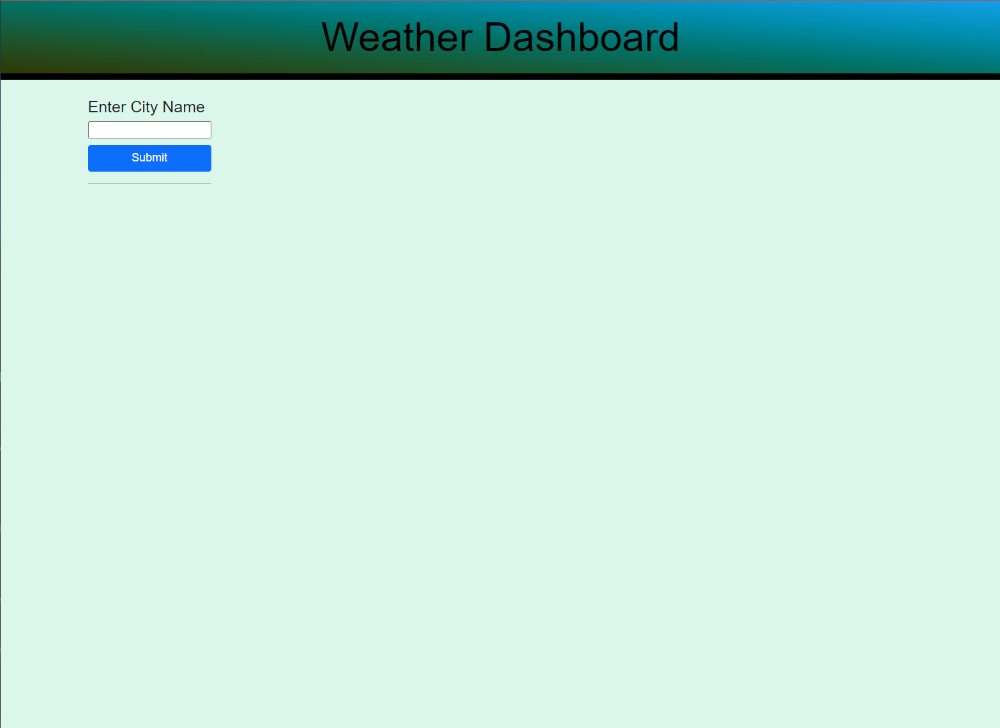
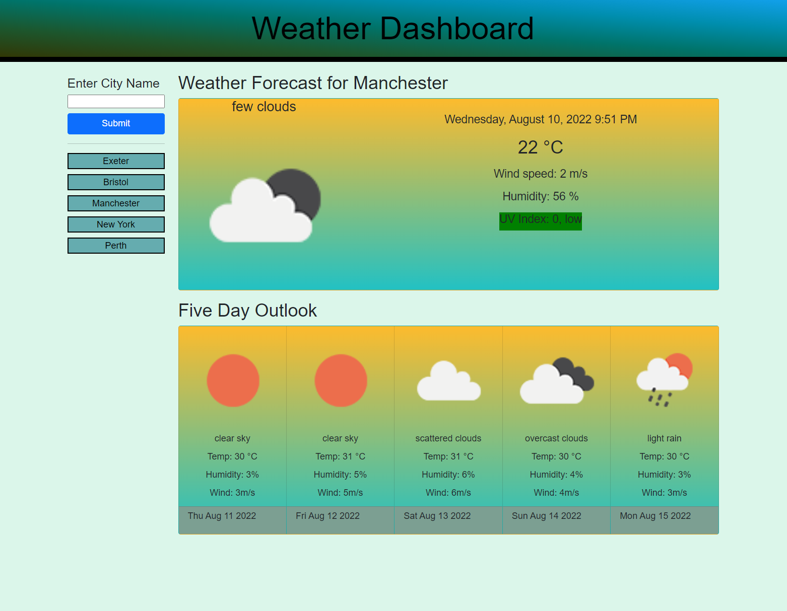
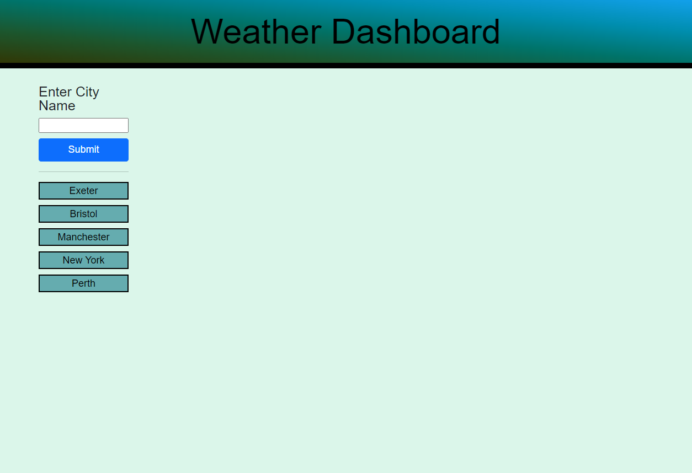

# Server-Side APIs Challenge: Weather Dashboard

This challenge forms part of the course work for week 6, Module 6, set by the University of Birmingham and Trilogy Ltd's Coding Bootcamp.

## Project Description
---

The aim of this challenge was to build a weather dashboard, from scratch, to display current weather and a five day weather forecast for a user selected city. The <a href="https://openweathermap.org/api/one-call-api">OpenWeather One Call API</a> has been used to retrieve weather data for a user selected city.  User searches are added to search history for easier access.

## Project Requirements
---
This challenge required the app to run in the browser and include dynamically updated HTML and CSS powered by JavaScipt and/or JQuery code.

 
###  Mock-up of  Weather Dashboard

The following image was provided as an example to show the appearance needed to meet the criteria of this challenge.


The functionality that the Weather Dashboard app was required to implement, is defined by the user story and acceptance criteria listed below.  


### User Story
```
AS A traveller
I WANT to see the weather outlook for multiple cities
SO THAT I can plan a trip accordingly

```


### Acceptance Criteria
```
GIVEN a weather dashboard with form inputs
WHEN I search for a city
THEN I am presented with current and future conditions for that city and that city is added to the search history
WHEN I view current weather conditions for that city
THEN I am presented with the city name, the date, an icon representation of weather conditions, the temperature, the humidity, the wind speed, and the UV index
WHEN I view the UV index
THEN I am presented with a colour that indicates whether the conditions are favourable, moderate, or severe
WHEN I view future weather conditions for that city
THEN I am presented with a 5-day forecast that displays the date, an icon representation of weather conditions, the temperature, the wind speed, and the humidity
WHEN I click on a city in the search history
THEN I am again presented with current and future conditions for that city

```
 
## Usage
---
- Open the <a href="https://beanalini.github.io/purplehaze/"> Weather Dashboard App.</a>
- On first use of the app the user is presented with a search form.
- Type a city name into the search form input box and click the submit button to display the weather for the city requested.
- The user is presented with the current weather forecast and a 5-day weather outlook.  
- Current weather information displays an icon representation of the weather condition, along with a description; date and time, temperature, windspeed, humidity and UV index. The units of measurement for the weather conditions is presented in metric units. in The value of UV index is displayed along with its category and colour classification in line with the  global solar index.
- A Five day outlook giving a weather description along with an icon representation, temperature, humidity, wind speed  and the date is displayed, for each day, below the current forecast.
- The name of the searched city will immediately appear in the search history below the submit button, and is stored locally allowing the user to access previous searches. 
- Click a search history city button to view the weather conditions for that city.
- On web browser reload, search history is displayed allowing the user to click on the city to view current and 5-day weather conditions. 


##  Weather Dashboard Screen Shots
---

Initial state of the Weather Dashboard landing page prior to the user having made any searches.




Weather Dashboard page after a user has entered a city name. Previous city search buttons are shown below the submit button, allowing the user to click on a city button to display current and 5-day weather forecast.




When a user reloads their browser, they are presented with the submit button and previous search history buttons.



## Deployed Website
---

<a href="https://beanalini.github.io/purplehaze/">Link to the deployed Weather Dashboard website </a>


<a href="https://github.com/Beanalini/purplehaze"> Link to the Weather Dasboard App repository</a>

## Technologies Used
---
- HTML
- CSS
- JavaScript
- JQuery
-Bootstrap
- Open Weather one call API

